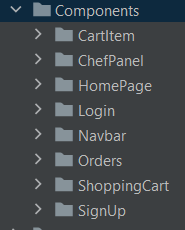

# McPoliba

Si vuole realizzare un’applicazione web per la gestione degli ordini all’interno di un fast food

## Frontend

All'interno del frontend dell'applicazione web è presente una cartella con delle directories, che 
racchiudono tutti i componenti visivi della stessa.

### ShoppingCart

Il primo di questi è rappresentato da ShoppingCArt, il carello che permette di 
concludere o modificare l'ordine.

### CartItem

Il componente CartItem si collega alla visualizzazione dei panini, del loro prezzo e la 
possibilità di inserirli nel carrello.

### HomePage 

La pagina principale permette la creazione di un ordine dal menù.

### Login 

Questo componente permette di effettuare il login se si è 
già registrati per poter visuallizare i propri ordini.

### Login

Questo componente permette di effettuare la registrazione.

### Navbar

La Navbar è il container per i vari bottoni, tra cui gli ordini, 
il carello e la possibilità di effettura il logout 

### Orders 

Orders consente di visualizzare la presa in carica di un ordine e quelli attivi

